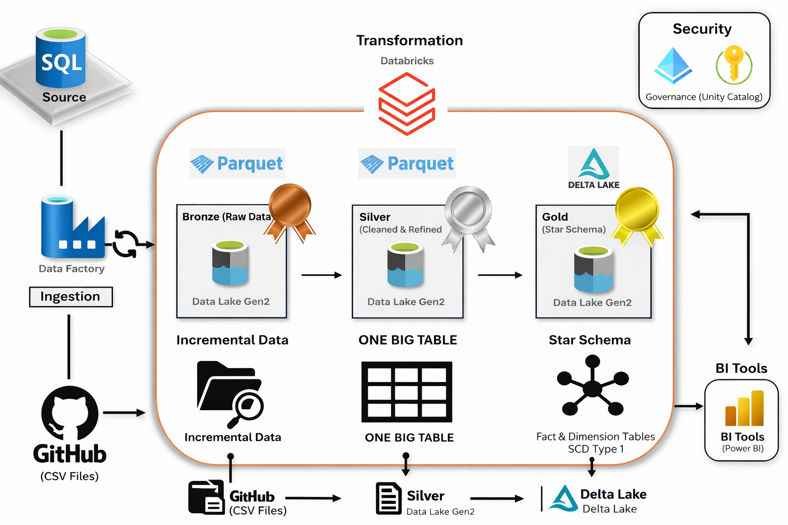
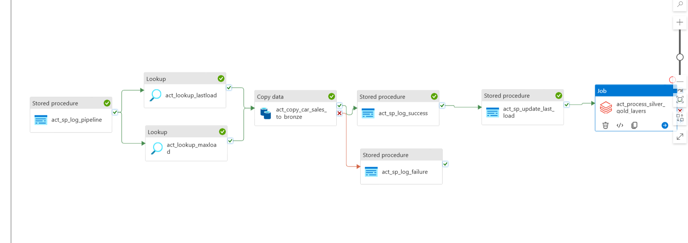

# Azure Data Engineering Project – Architecture

## Overview
This project implements an **end-to-end Azure Data Engineering Lakehouse** using the **Medallion Architecture (Bronze–Silver–Gold)**.

It demonstrates how raw transactional data is ingested safely and incrementally, refined using Spark-based processing, governed using Unity Catalog, and finally modeled into analytics-ready datasets.

The architecture is intentionally designed to be:
- Production-aligned
- Incremental and idempotent
- Retry-safe and failure-aware
- Governed and auditable
- Suitable for interview and portfolio showcase

---

## High-Level Architecture Diagram

---

## Azure Data Factory – Bronze Ingestion Pipeline

This pipeline demonstrates:
- Watermark-driven incremental ingestion
- Run-based idempotent Bronze writes
- Explicit run lifecycle tracking (STARTED / SUCCESS / FAILED)
- Safe retry handling without data corruption

---

## Architecture Components

### 1. Data Sources
- **GitHub (CSV files)**  
  Used to simulate external/raw data sources.
- **Azure SQL Database**  
  Acts as a transactional source system storing structured sales data.

---

### 2. Ingestion & Orchestration
- **Azure Data Factory (ADF)**
  - Orchestrates data movement and execution flow
  - Handles **initial load** and **incremental loads**
  - Uses **watermark-based CDC logic**
  - Implements **run-level audit logging**
  - Writes data to Bronze using **run-based isolation** to ensure idempotency

---

### 3. Storage Layer (ADLS Gen2)
Data is stored in Azure Data Lake Storage Gen2, organized using the Medallion pattern:

#### 🥉 Bronze Layer
- Raw, immutable, append-only data
- Incrementally ingested from Azure SQL
- Stored in **Parquet** format
- **Run-isolated folder structure (`run_id=...`)**
- No business transformations

#### 🥈 Silver Layer
- Cleaned and standardized data
- Deduplication and business rules applied
- Incremental processing based on **successful Bronze runs**
- Stored in **Parquet** format
- Append-based, non-mutating design
- Designed for deterministic reprocessing

#### 🥇 Gold Layer
- Analytics-ready datasets
- Star schema implementation:
  - Fact tables
  - Dimension tables
- Handles **Slowly Changing Dimensions (SCD Type 1)**
- Optimized for BI consumption
- Implemented using **Delta Lake**

---

### 4. Processing Layer
- **Azure Databricks**
  - Spark-based transformations
  - Incremental processing logic
  - Surrogate key generation
  - Fact–dimension modeling
  - Gold-layer MERGE operations using Delta Lake

---

### 5. Governance & Security
- **Unity Catalog**
  - Centralized data governance
  - Catalogs, schemas, and tables
  - Access control & permissions
  - Data lineage and auditing

---

### 6. Consumption Layer
- **Power BI (optional)**
  - Connects to Gold layer
  - Used by analysts for reporting and dashboards

---

## Data Flow Summary

1. CSV data hosted on GitHub
2. Loaded into Azure SQL Database (source preparation)
3. Azure Data Factory:
   - Reads last successful watermark
   - Ingests incremental data
   - Writes to run-isolated Bronze paths
   - Logs run status and updates watermark only on success
4. Azure Databricks:
   - Processes only successful Bronze runs
   - Transforms Bronze → Silver (append-based)
   - Models Silver → Gold (Star Schema)
5. Unity Catalog enforces governance
6. Gold layer consumed by BI tools

---

## Key Design Highlights

- Parameterized ADF pipelines
- Watermark-based incremental ingestion
- Run-based idempotent Bronze design
- Retry-safe orchestration with explicit run tracking
- Append-based Silver layer using Parquet
- Delta Lake for Gold-layer ACID guarantees
- Star schema modeling using Spark
- Unity Catalog for enterprise-grade governance

---

## Why This Architecture Matters

This project reflects **real-world Azure Data Engineering practices** and demonstrates capabilities expected from a **mid-level to senior Data Engineer**, including:

- Lakehouse architecture design
- Incremental and idempotent ingestion
- Orchestration with operational state management
- Deterministic data processing
- Dimensional data modeling
- Cloud-native governance and scalability
